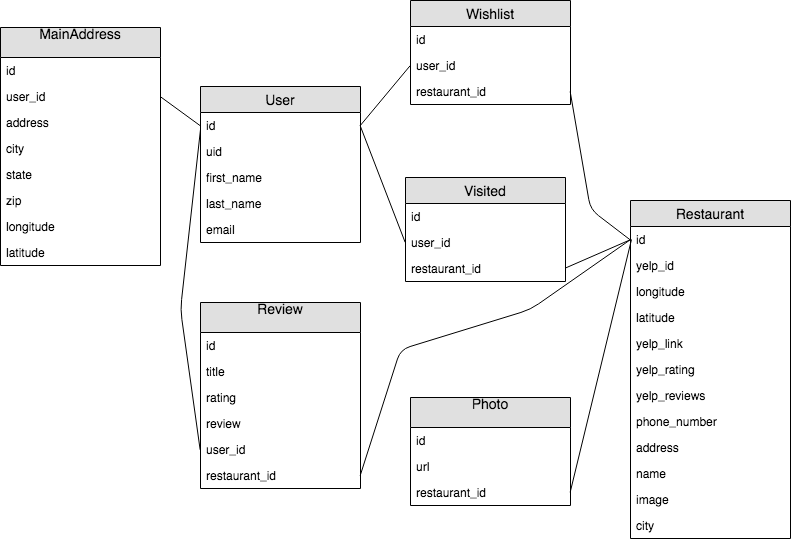

# README
Pitcher uniquely utilizes first impressions of menu-item images to create a quick and easy experience for picking a restaurant to dine in.

A user registers with preferred default restrictions, such as location and travel distance, and can immediately jump into viewing images of food items to find what they're looking for. Because the settings are assumed first, optional to change, the user is not bogged down by making decisions about what they're interested in before getting started. When users are experiencing symptoms of hunger, such as severe grouchiness, confusion, apathy, inability to compromise, indecision, marital crisis, or financial recklessness, they are often unable to make these decisions up-front, costing more time and worsening symptoms. Users in this compromised or paralyzed state may find apps like GrubHub to be inaccessible. Pitcher, while not FDA regulated or specifically a medical app, is the all-in-one solution to remedy these unfortunate conditions - and quickly!





## Versions
Ruby version: ``ruby '2.4.1'``

Rails version: ``'rails', '~> 5.2.2'`` (without Mini-test, Turbolinks & Spring)

Database: Postgresql

## Install
1 - Setup Environment: Upon download, run ``bundle install``.

2 - Setup DB: ``bundle exec rake db:{drop,create,migrate,seed}``

3 - Setup Yelp API:
  - Get a [client_id & access token](https://www.yelp.com/fusion)
  - ``bundle exec figaro install``
  - Store API keys in config/application.yml
    - YELP_API_KEY: <client_id>

4 - Setup Google API:
  - Get a [client_secret & client_id](https://developers.google.com/identity/sign-in/web/sign-in)
  - Store API keys in config/application.yml
    - google_client_id: <client_id>
    - google_secret: <client_secret>

5 - Setup Google Maps Api:
  - register for google premium to obtain a google_maps_api_key at https://cloud.google.com/maps-platform/
  - Store API key in config/application.yml
  - google_maps_api_key: <client_id>

## Gems
- ``gem 'pg', '>= 0.18', '< 2.0'``
- ``gem 'figaro'``
- ``gem 'faraday'``
- ``gem 'google-api-client'``
- ``gem 'omniauth-google-oauth2'``

##### Testing & Development:
- ``gem 'pry'``
- ``gem 'simplecov'``
- ``gem 'rspec-rails'``
- ``gem 'shoulda-matchers', '~> 3.1'``
- ``gem 'capybara'``
- ``gem 'launchy'``
- ``gem 'webmock'``
- ``gem 'vcr'``
- ``gem 'factory_bot_rails'``
- ``gem 'faker'``
- ``gem 'awesome_print'``

## Testing
MiniTest has been excluded from this app, opting for RSpec instead. See 'Install' to install RSpec.

Run RSpec via ``bundle exec rspec``

Test data is mocked with [WebMock](https://github.com/bblimke/webmock) and [VCR](https://github.com/vcr/vcr)

## Scope

## Future
```
A User can invite a friend(s) to use the app to find their preferred dining location.
The pair/group is then suggested a restaurant that most closely matches each person's preference.
```

```
A User does not have to visit a restaurant through the app to be able to review (like / dislike) it.
This action saves their review and affects their personal profile.
```

```
Restaurant show pages display statistics about popularity via Pitcher User visit like/dislike data.
```
